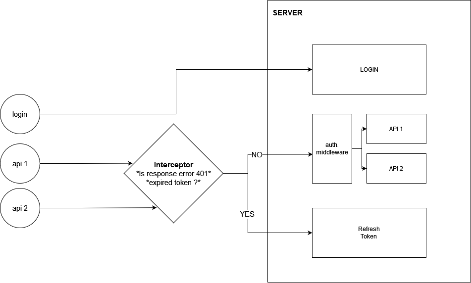

### [Set up instruction](https://gist.github.com/hellonathapon/710f3789ef64da88f9e3e2b3db6f3646)

### Project Stacks
* mySQL
* Express.js
* JWT
* React.js

This project demonstates the complete work flow of Full-stack web developement which has JWT. implementing on top of its Authentication.
